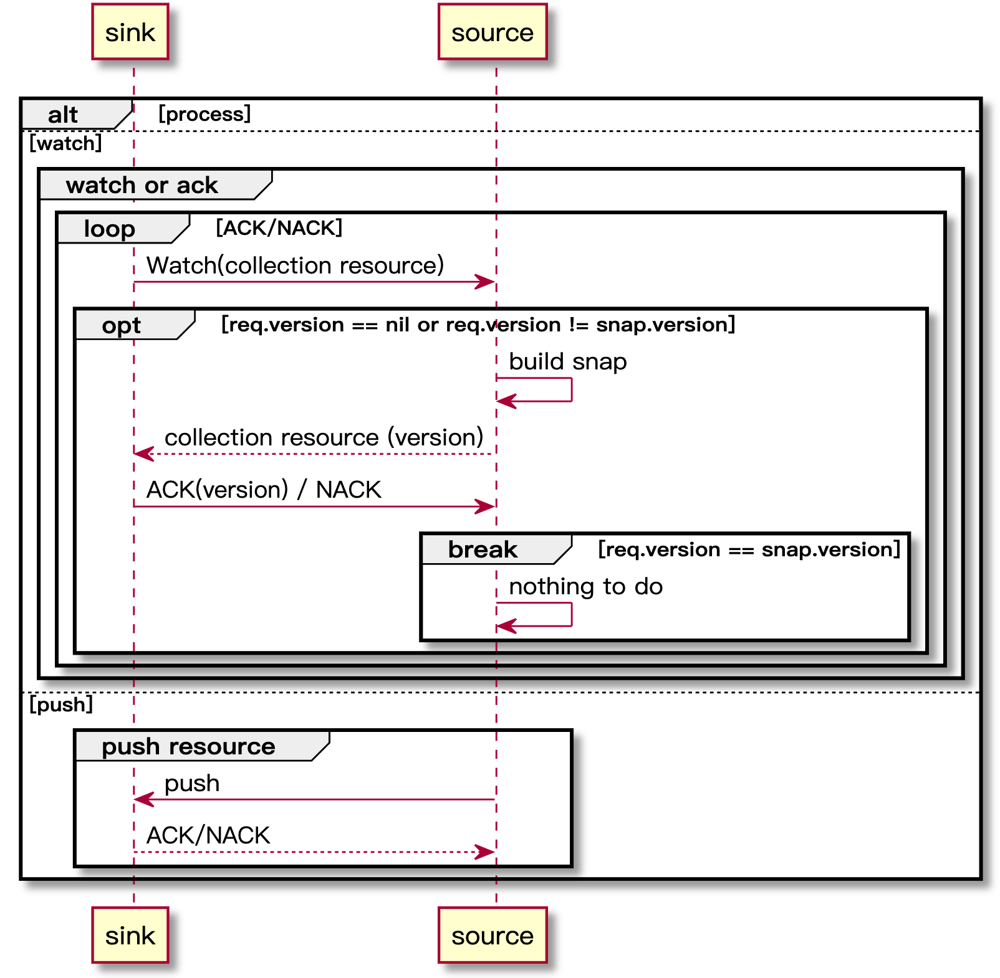

# mcpserver

`MCP` mode is replaced by `XDS-OVER-MCP` after istio 1.9
- [https://github.com/istio/istio/pull/28634](https://github.com/istio/istio/pull/28634)
- [https://docs.google.com/document/d/1lHjUzDY-4hxElWN7g6pz-_Ws7yIPt62tmX3iGs_uLyI/edit#](https://docs.google.com/document/d/1lHjUzDY-4hxElWN7g6pz-_Ws7yIPt62tmX3iGs_uLyI/edit#)

istio mcp server demo

## mcp process

